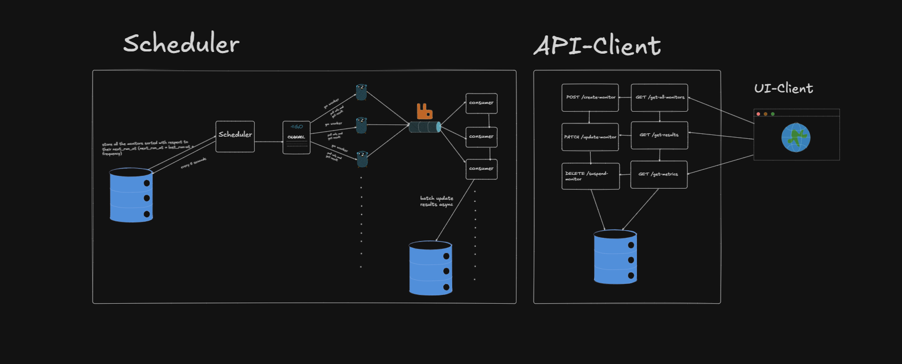

# Probe

## 1. What is Probe?

Probe is a monitoring and observability tool for tracking the performance, availability, and reliability of web services and APIs.

It helps teams understand system behavior in real time by collecting and analyzing key request metrics.

---

## Architecture diagram



---

## 2. What does Probe do?

Probe provides:

- HTTP monitoring for API response times, status codes, and uptime
- Performance metrics such as DNS, TCP, TLS, and total response latency
- Continuous probing of configured endpoints on a schedule
- Visualization of collected metrics through dashboards
- Alerting support (planned/optional)

---

## 3. Why use Probe?

Modern applications depend on APIs and distributed services. Without monitoring:

- Failures can go unnoticed
- Performance bottlenecks are hard to detect
- User experience can degrade silently

Probe helps by:

- Providing clear visibility into service health
- Detecting latency spikes and downtime early
- Supporting data-driven debugging and optimization

---

## 4. How Probe works

Probe follows this pipeline:

1. User configuration
2. Scheduler/worker
3. Execution engine
4. Storage layer
5. API layer
6. Frontend dashboard

---

## 5. Self-host Probe

### Prerequisites

- Docker
- Docker Compose
- (Optional) Cloud VM (AWS EC2, GCP, Azure, etc.)

### Step 1: Create `docker-compose.yml`

```yaml
services:
  mysql:
    image: mariadb:11
    container_name: mysql
    restart: unless-stopped
    environment:
      MYSQL_ROOT_PASSWORD: ${DB_PASSWORD}
      MYSQL_DATABASE: ${DB_NAME}
    ports:
      - "3307:3306"
    volumes:
      - mariadb_data:/var/lib/mysql

  rabbitmq:
    image: rabbitmq:3-management
    container_name: rabbitmq
    restart: unless-stopped
    ports:
      - "5672:5672"
      - "15672:15672"

  app:
    image: dhruvthak3r/probe
    container_name: probe
    restart: unless-stopped
    env_file:
      - .env
    depends_on:
      - mysql
      - rabbitmq
    ports:
      - "8181:8080"

  probe-ui:
    image: dhruvthak3r/probe-ui
    container_name: probe-ui
    restart: unless-stopped
    depends_on:
      - app
    ports:
      - "3000:80"

volumes:
  mariadb_data:
```

### Step 2: Create `.env`

```env
DB_USER=<DB_USER>
DB_PASSWORD=<DB_PASSWORD>
DB_HOST=<DB_HOST>
DB_PORT=<DB_PORT>
DB_NAME=<DB_NAME>

RABBITMQ_URL=<URL>
```

### Step 3: Start services

```bash
docker compose up -d
```

### Step 4: Verify services

```bash
docker compose ps
```

### Step 5: Access services

- Frontend UI: `http://localhost:3000`
- API: `http://localhost:8181`
- RabbitMQ dashboard: `http://localhost:15672` (`guest/guest`)

---

## 6. Export and migrate MySQL data to another machine

### 6.1 Create dump on source machine

Run from the folder containing your `docker-compose.yml`:

```bash
docker compose exec -T mysql mysqldump -u"${DB_USER}" -p"${DB_PASSWORD}" "${DB_NAME}" > probe_dump.sql
```

This creates `probe_dump.sql` on your host machine.

### 6.2 Copy dump file to target machine

Example using `scp`:

```bash
scp probe_dump.sql user@target-machine:/path/to/probe/
```

### 6.3 Restore dump on target machine

On target machine (after stack is up):

```bash
docker compose exec -T mysql mysql -u"${DB_USER}" -p"${DB_PASSWORD}" "${DB_NAME}" < probe_dump.sql
```

### 6.4 Verify restore

```bash
docker compose exec mysql mysql -u"${DB_USER}" -p"${DB_PASSWORD}" -e "USE ${DB_NAME}; SHOW TABLES;"
```

---